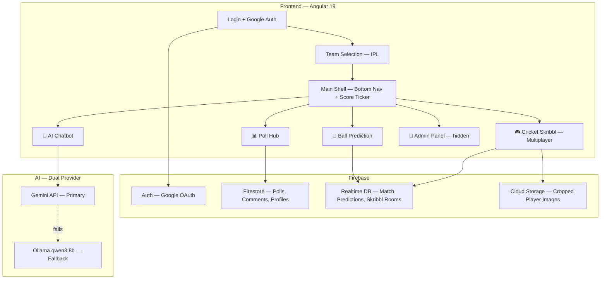

# CricPulse: Implementation Plan v2 (Feedback Incorporated)

## Changes From Your Feedback

| Your Comment | What I'll Do |
|:---|:---|
| Add Ollama qwen3:8b backup if Gemini fails | ✅ Dual AI provider — tries Gemini first, falls back to local Ollama |
| AI must be fun, cricket-only | ✅ Hard system prompt restriction — rejects non-cricket questions playfully |
| Skribbl: cropped body parts (eyes, feet, etc.) | ✅ Images will be cropped recognizable features, not full pixelated photos |
| Skribbl must be multiplayer | ✅ Full multiplayer rooms with Firebase Realtime DB |
| Also achievements & player questions | ✅ Multi-round: Image round → Achievement round → Stat round |
| Default to IPL | ✅ IPL teams only at launch |
| Cloud Run preferred for deploy | ✅ Cloud Run primary, Firebase Hosting as fallback |
| Create Firebase from scratch | ✅ Full step-by-step guide included |
| Cloud Functions only if time permits | ✅ Match sim runs on frontend, CF is optional |
| How to test & simulate? | ✅ Answered below |

---

## How Testing & Simulation Works

> [!TIP]
> **You asked: "How will we test and simulate it?"**

Here's the strategy:

**1. Mock Match Engine (runs in browser):**
- A JSON file contains a scripted 2-over match (ball-by-ball: dot, 1, 4, 6, wicket, etc.)
- A timer auto-advances balls every 20 seconds (configurable)
- The score ticker updates live based on the JSON sequence
- You can speed up/slow down/pause via a hidden admin panel (`/admin`)

**2. Multi-tab Testing:**
- Open 3-4 browser tabs, each logged in as a different Google account (or incognito)
- All tabs see the same match state synced via Firebase Realtime DB
- Vote in polls from one tab, see results update in another
- Join the same Skribbl room from multiple tabs
- Make different predictions from each tab, watch leaderboard

**3. Admin Controls (hidden `/admin` route):**
- Manually trigger: "next ball", "wicket", "six", "DRS review"
- Reset match to beginning
- Speed control: 5s / 10s / 20s per ball
- Force a specific ball result for demo purposes

**4. For the Hackathon Pitch:**
- Pre-script the exact 2-over sequence
- One person controls the admin panel backstage
- Others show the fan experience on a phone/projected browser

---

## Updated Architecture



---

## Dashboard 2: Cricket Skribbl — Full Multiplayer Design

Since you want full multiplayer, here's the detailed design:

### Room System
- User clicks "Find Match" → joins a random open room or creates one
- Room capacity: 2-8 players
- Room states: `waiting` → `playing` → `results`
- Host is first player to join; game starts when host clicks "Start" (min 2 players)

### Round Types (3 types, randomized)

**Type 1: Cropped Image Round**
- Show a tightly cropped body part of a cricketer (eyes, batting grip, shoes, celebration pose)
- Players type guesses in chat
- Image gradually zooms out every 5 seconds (3 zoom levels)
- First correct guess = 100pts, second = 75pts, etc.

**Type 2: Achievement Round**  
- Text clues appear one at a time:
  - Clue 1: "Scored 264 in an ODI" (hard, 100pts)
  - Clue 2: "Left-handed batsman" (medium, 75pts)  
  - Clue 3: "Played for Hyderabad" (easy, 50pts)
  - Clue 4: "Rohit Sharma" → auto-reveal

**Type 3: Jersey/Number Round**
- Show just a jersey number or team logo silhouette
- Players guess the player

### Game Flow
- 5 rounds per game (random mix of all 3 types)
- 30 seconds per round
- After each round: show correct answer + scoreboard
- After all rounds: podium (🥇🥈🥉) with confetti animation
- Points added to global leaderboard

### Data Model (Realtime DB)
```
/rooms/{roomId}/
  status: "waiting" | "playing" | "finished"
  hostId: string
  players: { [oderId]: { name, avatar, score, isReady } }
  currentRound: number
  totalRounds: 5
  roundData: {
    type: "image" | "achievement" | "jersey"
    answer: string (hidden from clients via security rules)
    hints: string[]
    currentHintIndex: number
    revealLevel: number
  }
  chat: { [messageId]: { userId, text, timestamp, isCorrect } }
```

### Image Assets
I'll generate ~15 cropped cricketer images using the image generation tool:
- Virat Kohli's batting stance (cropped to hands)
- MS Dhoni's keeping gloves  
- Jasprit Bumrah's bowling action (cropped to arm)
- Etc.

---

## Dashboard 4: AI Chatbot — Updated Design

### Dual Provider System
```
User message → Try Gemini API
                  ├─ Success → Return response
                  └─ Fail (timeout/error) → Try Ollama localhost:11434
                                              ├─ Success → Return response  
                                              └─ Fail → "AI unavailable" message
```

### Cricket-Only Restriction (System Prompt)
```
You are CricBot, the ultimate cricket companion. You are a die-hard {userTeam} fan.

STRICT RULES:
1. You ONLY talk about cricket. If asked about anything else, reply with a 
   fun cricket redirect like "Nice try, but I only speak cricket! 🏏 
   Ask me about DRS, player stats, or why {userTeam} is the best!"
2. Explain rules simply — like explaining to a 10-year-old
3. Be biased toward {userTeam} — celebrate their wins, be dramatic about losses
4. Keep responses short (2-3 sentences) and use cricket slang
5. React to match events with emotion based on {userTeam}'s perspective

Current match: {matchState}
```

### Match Notifications & Sounds
When match events happen:
- **User's team scores 6** → 🎉 Crowd roar sound + bot sends celebration
- **User's team loses wicket** → 😱 Gasp sound + bot sends worried message
- **Opponent scores 6** → 😤 Bot sends salty comment
- **Century** → 🎺 Stadium celebration sound
- **DRS** → 🔍 Bot explains what's happening

---

## Deployment: Cloud Run Strategy

### Why Cloud Run over Firebase Hosting?
- Better for the Gemini proxy (keeps API key server-side)
- Ollama fallback needs a server (can't run in browser)
- Judges see "Cloud Run" in your GCP console → extra points for using GCP

### Deployment Steps (I'll guide you through each)
1. Create GCP Project + Firebase Project (linked)
2. Enable required APIs (Cloud Run, Artifact Registry, Firebase)
3. Build Angular app → Docker container
4. Deploy to Cloud Run with env vars (Gemini key, Firebase config)
5. Set up Firebase services (Auth, Firestore, RTDB)
6. Connect custom domain (optional)

> [!NOTE]
> For the AI proxy, we'll create a simple Express.js server that handles Gemini/Ollama calls. This runs in the same Cloud Run container as the Angular app. Single deployment, zero complexity.

---

## Build Order (Updated)

### Phase 1: Foundation
- [ ] Angular 19 project scaffold
- [ ] Firebase config + create project (guide you)
- [ ] Global styles + IPL team theme system (10 teams)
- [ ] Google Auth login page (dark, neon aesthetic)
- [ ] IPL team selection page (team cards with logos)
- [ ] App shell: bottom nav + persistent score ticker
- [ ] Mock match data JSON (scripted 2-over drama)
- [ ] Match simulation engine (frontend timer-based)

### Phase 2: Poll Hub (Dashboard 1)
- [ ] Poll card component (vote bars, animations)
- [ ] Comment system under polls
- [ ] Real-time vote sync via Firestore
- [ ] Pre-loaded poll bank (20 questions)

### Phase 3: Prediction Engine (Dashboard 3)
- [ ] Prediction UI (Dot/1/2/3/4/6/Wicket buttons)
- [ ] 15-second countdown timer
- [ ] Result reveal animation
- [ ] Live leaderboard
- [ ] Points calculation

### Phase 4: AI Chatbot (Dashboard 4)
- [ ] Chat UI (messaging app style)
- [ ] Gemini API integration
- [ ] Ollama fallback
- [ ] Cricket-only system prompt
- [ ] Match event notifications + sounds
- [ ] Streaming text responses

### Phase 5: Cricket Skribbl (Dashboard 2)
- [ ] Room lobby (create/join)
- [ ] Multiplayer room sync (Realtime DB)
- [ ] Image round (cropped body parts)
- [ ] Achievement round (text clues)
- [ ] Jersey round
- [ ] In-game chat with guess detection
- [ ] Scoring + podium

### Phase 6: Polish & Deploy
- [ ] Admin panel for demo control
- [ ] Animations & micro-interactions
- [ ] Mobile responsiveness
- [ ] Sound effects system
- [ ] Dockerize for Cloud Run
- [ ] Deploy + guide you through GCP setup

---

## Remaining Questions

> [!IMPORTANT]
> **1. Ollama setup:** Do you have Ollama installed locally with qwen3:8b? If not, I'll add install instructions. Note: Ollama only works as fallback during LOCAL development — in Cloud Run production, we'd need a separate Ollama server or just gracefully handle Gemini failures.

> [!IMPORTANT]
> **2. Ready to start building?** If you approve this plan, I'll begin immediately with Phase 1. The entire build will take several hours of focused work. Shall I proceed?
